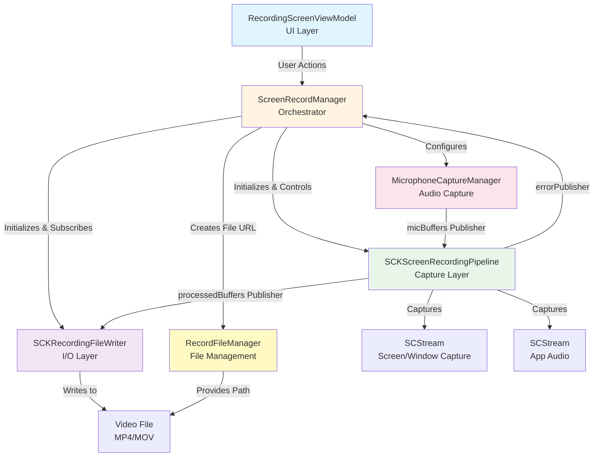

# Screen Recording Architecture

## Overview
The screen recording system follows a clean, decoupled architecture with clear separation of concerns. The `ScreenRecordManager` acts as the orchestrator, coordinating between capture, file management, and writing components.

## Architecture Diagram



## Component Responsibilities

### 1. **RecordingScreenViewModel** (UI Layer)
- Receives user actions (start, stop, pause, resume)
- Manages UI state and recording lifecycle
- Communicates with `ScreenRecordManager`

### 2. **ScreenRecordManager** (Orchestrator)
**Role**: Coordinates all recording components
- Initializes `SCKScreenRecordingPipeline` with display/window config
- Creates `SCKRecordingFileWriter` with video/audio settings
- Subscribes to pipeline's `processedBuffers` and forwards to writer
- Manages recording state (pause/resume)
- Handles errors from pipeline

**Key Properties**:
- `pipeline`: SCKScreenRecordingPipeline?
- `writer`: SCKRecordingFileWriter?
- `isPause`: Bool (triggers pause/resume on both pipeline and writer)

### 3. **SCKScreenRecordingPipeline** (Capture Layer)
**Role**: Captures screen, window, and audio streams
- Manages `SCStream` for screen/window capture
- Integrates `MicrophoneCaptureManager` for mic input
- Emits unified `RecordingBuffer` stream via Combine
- Handles pause/resume by stopping buffer emission
- Provides error notifications

**Outputs**:
- `processedBuffers`: AnyPublisher<RecordingBuffer, Never>
- `errorPublisher`: AnyPublisher<RecordingError, Never>

**Buffer Types**:
- `.video` - Screen/window frames
- `.appAudio` - System/app audio
- `.microphone` - Mic input

### 4. **MicrophoneCaptureManager** (Audio Capture)
**Role**: Captures microphone audio independently
- Uses `AVAudioEngine` for mic capture
- Handles Bluetooth vs built-in device routing
- Converts `AVAudioPCMBuffer` to `CMSampleBuffer`
- Emits mic buffers via Combine publisher

**Output**:
- `micBuffers`: AnyPublisher<CMSampleBuffer, Never>

### 5. **SCKRecordingFileWriter** (I/O Layer)
**Role**: Writes video/audio buffers to file
- Manages `AVAssetWriter` for video and audio tracks
- Handles pause/resume with timestamp adjustment
- Tracks accumulated pause duration
- Writes three buffer types: video, app audio, microphone

**Key Features**:
- Session management (start/end)
- Pause/resume with time adjustment
- Async/await based API

### 6. **RecordFileManager** (File Management)
**Role**: Manages recording file paths
- Creates output directory structure
- Generates unique file URLs with timestamps
- Provides file info retrieval
- Handles file deletion

## Data Flow

### Recording Start Flow
```
1. ViewModel calls ScreenRecordManager.record()
2. Manager creates file URL via RecordFileManager
3. Manager initializes Pipeline with display/window config
4. Manager initializes Writer with video/audio settings
5. Manager subscribes: Pipeline.processedBuffers → Writer.write()
6. Manager calls Pipeline.actionInput.send(.start)
7. Pipeline starts SCStream and MicrophoneCaptureManager
8. Buffers flow: SCStream → Pipeline → Writer → File
```

### Buffer Flow
```
Screen Capture (SCStream) ──┐
                            ├──→ Pipeline.processedBuffers ──→ Writer.write() ──→ File
App Audio (SCStream) ───────┤
                            │
Microphone (AVAudioEngine) ─┘
```

### Pause/Resume Flow
```
1. ViewModel sets ScreenRecordManager.isPause = true
2. Manager sends .pause to Pipeline.actionInput
3. Manager calls Writer.pause()
4. Pipeline stops emitting buffers (isPaused = true)
5. Writer records pause timestamp

Resume:
1. ViewModel sets ScreenRecordManager.isPause = false
2. Manager sends .resume to Pipeline.actionInput
3. Manager calls Writer.resume()
4. Pipeline resumes buffer emission
5. Writer calculates pause duration and adjusts timestamps
```

## Key Design Patterns

### 1. **Separation of Concerns**
- Pipeline: Capture only
- Writer: File I/O only
- Manager: Orchestration only

### 2. **Reactive Programming (Combine)**
- Pipeline emits buffers via publishers
- Manager subscribes and forwards to writer
- Decoupled communication between components

### 3. **Protocol-Oriented Design**
- `ScreenRecordingPipeline` protocol for capture abstraction
- `RecordingFileWriter` protocol for I/O abstraction
- Easy to swap implementations

### 4. **Factory Pattern**
- `WriterConfig.create()` for complex configuration
- Centralizes video/audio settings logic

## Debug Logging

The system includes comprehensive logging via `DebugLogger`:

**Categories**:
- 🎬 ACTION: User actions (start, stop, pause, resume)
- ⚡️ PIPELINE: Capture events and buffer flow
- 💾 WRITER: Write operations and session management
- 🎤 MIC: Microphone capture events
- ❌ ERROR: Error conditions
- ℹ️ INFO: General information

**What's Logged**:
- Recording lifecycle events
- Buffer flow (every 60th frame/buffer)
- Pause/resume with duration tracking
- File creation and completion
- Error conditions

## Configuration

### Video Settings
- Configured via `WriterConfig.create()`
- Supports H.264 (sRGB) and HEVC (Display P3)
- Auto-downscales for 4K/8K displays
- Uses `AVOutputSettingsAssistant` for optimal settings

### Audio Settings
- Sample Rate: 44,100 Hz
- Channels: 2 (Stereo)
- Format: AAC
- Separate tracks for app audio and microphone

### File Output
- Formats: MP4, MOV
- Location: `~/Documents/inneraivideos/`
- Naming: `recording-{timestamp}.{ext}`

## Error Handling

Errors flow from Pipeline → Manager → ViewModel:

```swift
Pipeline.errorPublisher
    .sink { error in
        DebugLogger.log(.error, "Pipeline error: \(error)")
        manager.onStopStream(nil)
    }
```

**Error Types**:
- `.captureStartFailed`: Failed to start SCStream
- `.captureStopFailed`: Failed to stop capture
- `.displayNotFound`: Invalid display ID
- `.custom(String)`: Configuration errors

## Future Improvements

1. **Separate Audio Writer**: Currently mic and app audio share the video writer
2. **Configurable Logging**: Runtime enable/disable per category
3. **Buffer Queue Management**: Handle backpressure if writer is slow
4. **Metrics Collection**: Track dropped frames, buffer delays
5. **Recovery Mechanisms**: Auto-restart on stream errors
