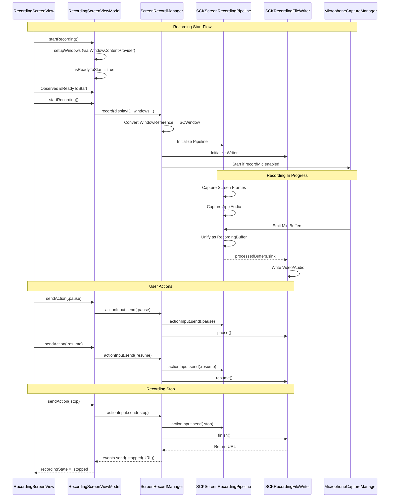
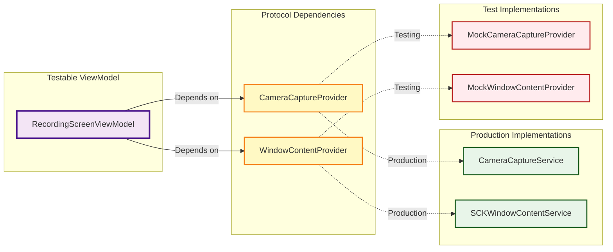
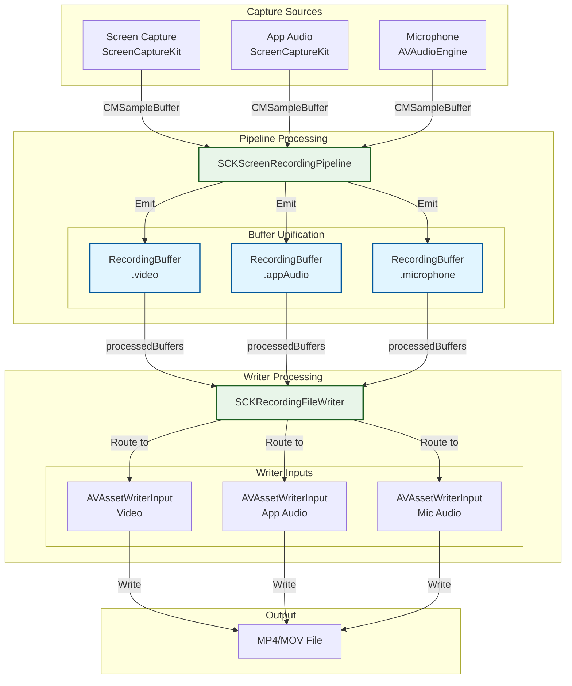

# Final Refactored Architecture

## Complete System Architecture

```mermaid
graph TB
    subgraph "UI Layer"
        View[RecordingScreenView<br/>SwiftUI]
        CameraView[CameraView<br/>SwiftUI]
        ControlPanel[ControlPanelView]
    end
    
    subgraph "Presentation Layer - Framework Independent"
        ViewModel[RecordingScreenViewModel<br/>✅ No Framework Imports<br/>Only Combine]
        
        subgraph "Protocols"
            CameraProtocol[CameraCaptureProvider<br/>Protocol]
            WindowProtocol[WindowContentProvider<br/>Protocol]
        end
        
        subgraph "Type Wrappers"
            WindowRef[WindowReference<br/>Type-Erased Wrapper]
        end
    end
    
    subgraph "Business Logic Layer"
        Manager[ScreenRecordManager<br/>Orchestrator]
        Config[RecordingConfiguration<br/>Value Object]
        Events[RecordingEvent<br/>ViewEvent]
    end
    
    subgraph "Service Layer - Real Implementations"
        CameraService[CameraCaptureService<br/>AVFoundation]
        WindowService[SCKWindowContentService<br/>ScreenCaptureKit]
        Pipeline[SCKScreenRecordingPipeline<br/>ScreenCaptureKit]
        Writer[SCKRecordingFileWriter<br/>AVFoundation]
        MicManager[MicrophoneCaptureManager<br/>AVAudioEngine]
    end
    
    subgraph "Test Layer"
        MockCamera[MockCameraCaptureProvider]
        MockWindow[MockWindowContentProvider]
    end
    
    subgraph "Model Layer"
        RecordingBuffer[RecordingBuffer<br/>Unified Buffer Type]
        WriterConfig[WriterConfig<br/>Configuration]
        FileManager[RecordFileManager<br/>File Operations]
    end
    
    subgraph "Utilities"
        DebugLogger[DebugLogger<br/>Structured Logging]
        Helpers[RecordingHelpers<br/>Utilities]
    end
    
    %% UI to ViewModel
    View -->|Actions| ViewModel
    View -->|Observes State| ViewModel
    CameraView -->|Uses| CameraProtocol
    ControlPanel -->|Sends Actions| ViewModel
    
    %% ViewModel Dependencies (Protocol Only)
    ViewModel -->|Depends on| CameraProtocol
    ViewModel -->|Depends on| WindowProtocol
    ViewModel -->|Uses| WindowRef
    ViewModel -->|Creates| Manager
    ViewModel -->|Emits| Events
    
    %% Protocol Implementations
    CameraProtocol -.->|Implemented by| CameraService
    CameraProtocol -.->|Mocked by| MockCamera
    WindowProtocol -.->|Implemented by| WindowService
    WindowProtocol -.->|Mocked by| MockWindow
    
    %% Manager Orchestration
    Manager -->|Uses| Config
    Manager -->|Creates| Pipeline
    Manager -->|Creates| Writer
    Manager -->|Converts| WindowRef
    Manager -->|Emits| Events
    
    %% Service Dependencies
    Pipeline -->|Captures Screen| WindowService
    Pipeline -->|Captures Audio| MicManager
    Pipeline -->|Emits| RecordingBuffer
    Writer -->|Writes| RecordingBuffer
    Writer -->|Uses| WriterConfig
    Writer -->|Saves to| FileManager
    
    %% Logging
    ViewModel -.->|Logs| DebugLogger
    Manager -.->|Logs| DebugLogger
    Pipeline -.->|Logs| DebugLogger
    Writer -.->|Logs| DebugLogger
    
    %% Styling
    classDef uiLayer fill:#e1f5ff,stroke:#01579b,stroke-width:2px
    classDef viewModelLayer fill:#f3e5f5,stroke:#4a148c,stroke-width:3px
    classDef protocolLayer fill:#fff9c4,stroke:#f57f17,stroke-width:2px
    classDef serviceLayer fill:#e8f5e9,stroke:#1b5e20,stroke-width:2px
    classDef testLayer fill:#ffebee,stroke:#b71c1c,stroke-width:2px
    classDef modelLayer fill:#e0f2f1,stroke:#004d40,stroke-width:2px
    
    class View,CameraView,ControlPanel uiLayer
    class ViewModel viewModelLayer
    class CameraProtocol,WindowProtocol,WindowRef protocolLayer
    class CameraService,WindowService,Pipeline,Writer,MicManager serviceLayer
    class MockCamera,MockWindow testLayer
    class RecordingBuffer,WriterConfig,FileManager,Config,Events modelLayer
```

## Data Flow Architecture

## Dependency Injection Architecture

## Buffer Flow Architecture

## Layer Responsibilities

### 🎨 UI Layer
- **RecordingScreenView**: SwiftUI view, handles UI events, observes ViewModel
- **CameraView**: Camera preview with presentation styles
- **ControlPanelView**: Recording controls (play/pause/stop/restart/delete)

### 🧠 Presentation Layer (Framework-Independent)
- **RecordingScreenViewModel**: 
  - ✅ NO framework imports (only Combine)
  - Manages UI state
  - Coordinates services via protocols
  - Emits view events
  - 100% testable

### 🔌 Protocols
- **CameraCaptureProvider**: Camera abstraction
- **WindowContentProvider**: Window lookup abstraction
- **ScreenRecordingPipeline**: Recording pipeline abstraction
- **RecordingFileWriter**: File writing abstraction

### 🎬 Business Logic Layer
- **ScreenRecordManager**: Orchestrates recording workflow
- **RecordingConfiguration**: Immutable configuration
- **RecordingEvent/ViewEvent**: Event types

### ⚙️ Service Layer
- **SCKScreenRecordingPipeline**: Screen/audio capture using ScreenCaptureKit
- **SCKRecordingFileWriter**: File writing using AVFoundation
- **CameraCaptureService**: Camera capture using AVFoundation
- **SCKWindowContentService**: Window management using ScreenCaptureKit
- **MicrophoneCaptureManager**: Microphone capture using AVAudioEngine

### 🧪 Test Layer
- **MockCameraCaptureProvider**: Camera mock for testing
- **MockWindowContentProvider**: Window mock for testing

### 📦 Model Layer
- **RecordingBuffer**: Unified buffer wrapper
- **WindowReference**: Type-erased window wrapper
- **WriterConfig**: Writer configuration
- **RecordFileManager**: File management

### 🛠️ Utilities
- **DebugLogger**: Structured, categorized logging
- **RecordingHelpers**: Helper functions

## Key Design Patterns

1. **Dependency Injection**: All dependencies injected via init
2. **Protocol-Oriented**: ViewModel depends on protocols only
3. **Type Erasure**: `WindowReference` hides `SCWindow` from ViewModel
4. **Publisher/Subscriber**: Combine for reactive data flow
5. **Orchestrator**: `ScreenRecordManager` coordinates components
6. **Factory Method**: `WriterConfig.create()` for complex configuration
7. **Strategy Pattern**: Different recording modes (fullscreen/window/camera)

## Benefits Achieved

✅ **100% Testable ViewModel** - No framework dependencies  
✅ **Clean Architecture** - Clear layer separation  
✅ **SOLID Principles** - All 5 principles followed  
✅ **Reactive** - Combine-based data flow  
✅ **Maintainable** - Single responsibility per component  
✅ **Flexible** - Easy to swap implementations  
✅ **Observable** - Comprehensive debug logging  
✅ **Type-Safe** - Protocol-based contracts  
